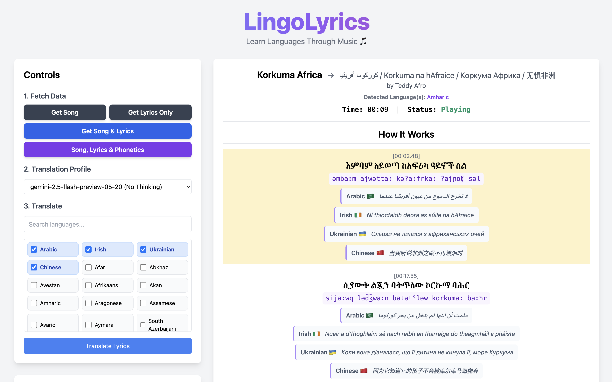

# LingoLyrics 🎵

Learn languages through music by viewing real-time, translated lyrics for your currently playing Spotify song. This app fetches synchronized lyrics, translates them into your chosen languages using the Google Gemini API, and can even provide phonetic transcriptions.



## Features

- **Real-time Lyrics:** Fetches and displays synchronized lyrics for the currently playing song on Spotify.
- **Multi-language Translation:** Translate lyrics into multiple languages at once.
- **Phonetic Transcriptions:** View IPA phonetic spellings for the original lyrics.
- **Automatic Language Detection:** Automatically detects the language(s) of the song.
- **Model Selection:** Choose from various Google Gemini models to balance speed and quality.
- **Smart Caching:** Lyrics, translations, and phonetics are cached to make subsequent requests faster.

## Setup

1.  **Clone the repository:**
    ```bash
    git clone https://github.com/your-repo/lyricslingo.git
    cd lyricslingo
    ```

2.  **Install dependencies:**
    ```bash
    pip install -r requirements.txt
    ```

3.  **Create your `.env` file:**
    Create a file named `.env` in the root of the project and add the following, filling in your own credentials.

    ```env
    # Spotify Credentials
    SPOTIPY_CLIENT_ID='your_spotify_client_id'
    SPOTIPY_CLIENT_SECRET='your_spotify_client_secret'
    SPOTIPY_REDIRECT_URI='http://localhost:8000' # Must match the one in your Spotify App dashboard

    # Google AI Credentials
    GEMINI_API_KEY='your_gemini_api_key'
    ```

4.  **API Keys:**
    -   **Spotify:** Follow the **[Spotify Web API Getting Started Guide](https://developer.spotify.com/documentation/web-api/tutorials/getting-started)** to create an application and get your `Client ID` and `Client Secret`. Make sure to add your `SPOTIPY_REDIRECT_URI` to the settings on your Spotify app dashboard.
    -   **Google:** Get your `API Key` from [Google AI Studio](https://ai.google.dev/).

5.  **Run the application:**
    ```bash
    python main.py
    ```
    The app will start, and you can access it at the redirect URI you configured (e.g., `http://localhost:8000`).

## Known Issues & Limitations

This is a personal project and has several limitations:

-   **No Lyrics Available:** The primary failure point. The app relies on the `syncedlyrics` library to find LRC files. If no synchronized lyrics are found for a song on its sources (like Musixmatch, Lrclib, etc.), the app cannot display them.
-   **AI Failures:**
    -   The Gemini model may occasionally fail to generate a translation or phonetics.
    -   The model might not adhere to the strict line-by-line output format requested, causing the parsing to fail. An error message will be displayed in place of the translation.
-   **Language Detection:** Detection is run on a sample of the lyrics and may be inaccurate for songs with very few words or multiple languages.
-   **Spotify Auth:** The app is intended for a single, local user. The Spotify token is stored in a `.cache` file. If you encounter persistent authentication errors, deleting this file and re-authenticating may solve the issue.
-   **Enhanced LRC:** The app can parse both plain and "enhanced" (word-by-word) LRC files, but highlighting is only done line-by-line. 