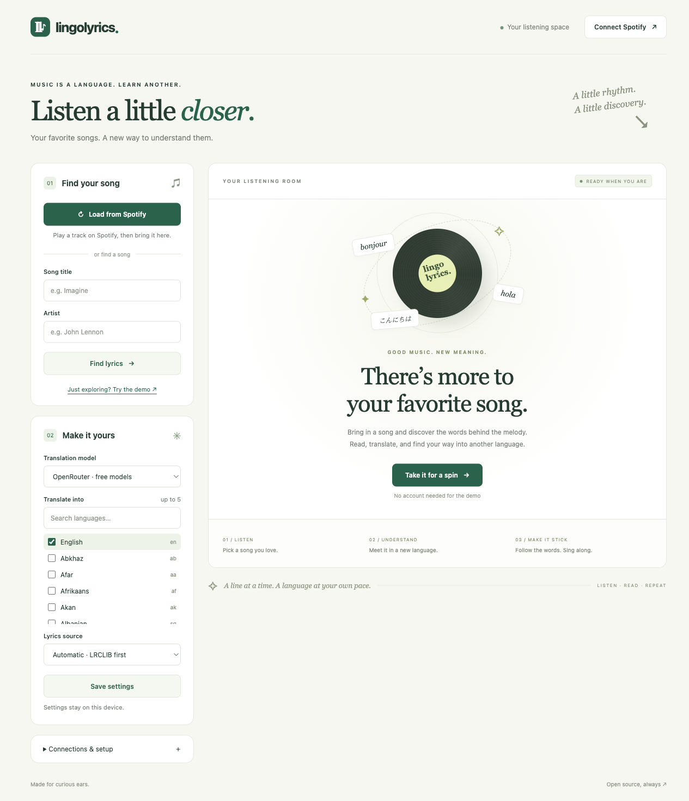

# LingoLyrics

Learn languages through music: find lyrics, follow Spotify playback, translate into several languages, and add IPA pronunciation.



## What works without an account?

Run the app and choose **Try the demo** for an original French sample with English translations and IPA. **Find lyrics** searches by song title and artist without Spotify or AI credentials. The demo timer demonstrates highlighting; it does not play audio.

## Setup

Requires **Python 3.12+**. Node 22.13+ is only needed for frontend linting and browser tests.

```sh
git clone https://github.com/s04/lingolyrics.git
cd lingolyrics
python3 -m venv .venv
source .venv/bin/activate
pip install -r requirements.txt
cp .env.example .env
python main.py
```

Open **http://127.0.0.1:8000**. Windows users can activate with `.venv\Scripts\activate`.

All credentials are optional; add only the integrations you want to `.env`, then restart:

| Setting | Purpose |
| --- | --- |
| `SPOTIPY_CLIENT_ID` / `SPOTIPY_CLIENT_SECRET` | Your Spotify application credentials |
| `SPOTIPY_REDIRECT_URI` | `http://127.0.0.1:8000/callback` |
| `GEMINI_API_KEY` | Direct Gemini access; `GOOGLE_API_KEY` is also accepted |
| `OPENROUTER_API_KEY` | OpenRouter access, including the free model router |
| `PORT` | Local server port; defaults to `8000` |

Register the **exact** callback URL in your [Spotify app settings](https://developer.spotify.com/dashboard), then choose **Connect Spotify** in LingoLyrics. Spotify no longer accepts `localhost` redirect URIs; use the loopback IP. If you change the port, update both redirect settings. The app does not silently pick another port. [Spotify redirect requirements](https://developer.spotify.com/documentation/web-api/concepts/redirect_uri).

This is a **single-user local app**: all tabs share one workspace and saved preferences. It binds to loopback and is not designed for public hosting or multiple accounts. Keys remain on the server; Spotify tokens are kept in the ignored `.cache` file. Do not commit `.env`, `.cache`, preferences, or cached lyrics. The app sends song metadata to the chosen lyrics source and sends lyrics to your selected AI provider only when you request translation or IPA.

## Using the app

1. Load the playing track from Spotify, search for a title and artist, or try the demo.
2. Pick a translation model, up to five languages, and a lyrics source. Choose **Save settings**.
3. **Translate** adds line-by-line translations, translated titles and detected languages. **Add IPA** adds pronunciation. These are separate actions; loading lyrics never triggers paid AI calls.
4. Hide translations or pronunciation for practice, use focus mode, copy the displayed text, or download the full current lyric sheet.
5. If a provider has a poor match or fails, choose another source, save, and **Retry source** to bypass the lyric cache.

Playback follows the loaded Spotify track. When Spotify changes tracks, the app asks you to load the new song instead of highlighting unrelated lyrics. Plain lyrics remain readable but do not claim synchronized timing.

## Gemini and OpenRouter

The curated Gemini catalog was checked against [Google's model documentation](https://ai.google.dev/gemini-api/docs/models) on September 21, 2026. It replaces the retired 2025 previews. The default is Gemini 3.1 Flash-Lite; other Flash generations and Gemini 3.1 Pro preview are available. Availability and pricing depend on your account and can change.

OpenRouter supports:

- **Free models**: requests the `openrouter/free` router. A key is still required; capacity and rate limits vary.
- **Auto (paid)**: uses `openrouter/auto`.
- **Custom model**: enter `provider/model`, or choose **Browse available models** to load the current catalog filtered for text output and structured-output support.

The app uses JSON schemas and validates response shape and line counts before replacing displayed lyrics. OpenRouter providers must support the requested parameters; unsupported model routes return an actionable error instead of silently dropping validation. Models can refuse lyrics or fail to translate accurately. Model changes produce distinct cache entries. [OpenRouter structured outputs](https://openrouter.ai/docs/guides/features/structured-outputs).

## Lyrics sources and research

**Automatic** tries direct LRCLIB first, then isolated adapters for NetEase, Kugou, QQ Music, and lyrics.ovh. Musixmatch, Megalobiz, and Genius remain manual diagnostic choices; they can be unavailable. LRCLIB exact lookup includes album/duration when Spotify supplies them. Search fallback only accepts matching titles/artists and, when known, durations within three seconds; it prefers synchronized lyrics among those matches. Instrumental responses are reported explicitly.

The legacy scraping adapters have a **10-second process deadline each**, including upstream retries. LRCLIB requests have a 12-second timeout; the UI operation has a 60-second deadline. Sources vary by catalog and region. Scraped provider failures may be indistinguishable from no results; a listed source is not a guarantee it works for every track.

Live checks on September 21, 2026 retrieved synchronized lyrics for *Imagine — John Lennon* from LRCLIB and NetEase. Musixmatch, Megalobiz, and Genius returned no result for that probe. This is a smoke test, not a catalog-wide reliability claim.

See [the research report](docs/lyrics-research.md) for the verified **OneTagger Rust lineage**, fork comparisons, alternatives, and remaining improvements. No external fork has been adopted or published.

## Development and checks

```sh
pip install -r requirements-dev.txt
ruff check .
ruff format --check .
djlint templates --lint
djlint templates --check
python -m pytest --cov --cov-report=term-missing
npm ci
npm run lint
npx playwright install chromium
npm test
```

Python tests isolate preferences and cache, disable dotenv loading, and block real HTTP transports. Browser tests start a separate credential-free server on port 8765 with isolated preferences, checking desktop and mobile layouts. Set `PYTHON` if the test runner should use a Python executable other than `.venv/bin/python`. CI runs the checks on Python 3.12 and 3.13.

Live lyric probes are deliberately separate from CI:

```sh
PYTHONPATH=. python scripts/check_lyrics.py
# Or test individual sources:
PYTHONPATH=. python scripts/check_lyrics.py lrclib NetEase
```

These print counts, timings, and outcomes, never complete lyrics. AI integration tests use synthetic responses. A live OpenRouter free-router request was also verified during this update; Gemini live requests require a configured key.

Dependencies are locked in `requirements.txt`, `requirements-dev.txt`, and `package-lock.json`. To refresh Python locks after reviewing updates:

```sh
uv pip compile --universal --python-version 3.12 --generate-hashes requirements.in -o requirements.txt
uv pip compile --universal --python-version 3.12 --generate-hashes requirements-dev.in -o requirements-dev.txt
```

Runtime frontend assets are local; there are no CDN or font requests. Vendored HTMX keeps its license in `static/vendor/HTMX-LICENSE`. The interface illustration is CSS. Original demo text is included in `demo.py`.

The latest local results and live-integration limits are recorded in [docs/verification.md](docs/verification.md).

## Local data and limitations

- Preferences: `data/preferences.json`; cache: `data/cache/`; Spotify tokens: `.cache`. None are served as static files.
- AI and lyric cache entries use content/model-aware hashed keys and atomic writes. Older cache files are harmless but are not reused by the new format.
- To reset preferences or cache, stop the app and remove the corresponding local file/folder. Reconnect Spotify after removing `.cache`.
- Provider outages, incorrect community timing, missing songs, and AI output errors remain possible. Your current lyric sheet is preserved if a new request fails.
- Timing is line-level. Word-level karaoke, persistent per-track offsets, candidate selection, and local LRC import are possible follow-ups documented in the research report.

See [LICENSE](LICENSE) for this project's license. Provider/library code licenses and rights in retrieved lyrics are separate matters.


### Standalone lyricfetch engine (optional)

The new [lyricfetch Go library and Python wrapper](https://github.com/s04/lyricfetch) provides the repaired NetEase cloudsearch API, Kugou, QQ Music, LRCLIB and lyrics.ovh in one bounded engine. Its Go and Python runtimes use their standard libraries only. To use it here:

```sh
# In a separate lyricfetch checkout:
go build -o bin/lyricfetch ./cmd/lyricfetch
# In LingoLyrics .env, set an absolute path:
# LYRICFETCH_BINARY=/absolute/path/to/lyricfetch/bin/lyricfetch
```

Restart LingoLyrics after configuring the binary. Automatic searches then use the Go engine's complete fallback, retaining plain lyrics while trying synchronized alternatives. It passes album/duration metadata, distinguishes provider failures from misses, and has a 25-second search budget plus a 27-second process deadline. Providers without duration metadata decline duration-constrained matches. Without this setting, the Python path remains available; no executable is downloaded automatically.

Research and attribution: [additional sources](docs/additional-sources-research.md), [lyrics.ovh source audit](docs/lyrics-ovh-source-audit.md), and [lyricfetch prior art](https://github.com/s04/lyricfetch/blob/main/docs/prior-art.md).
